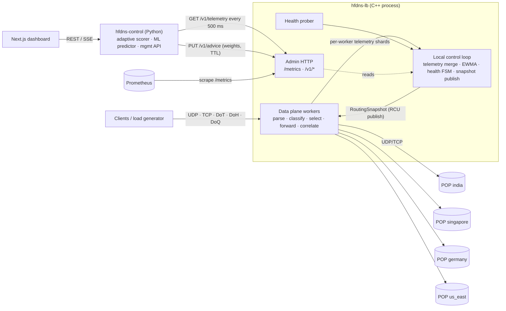
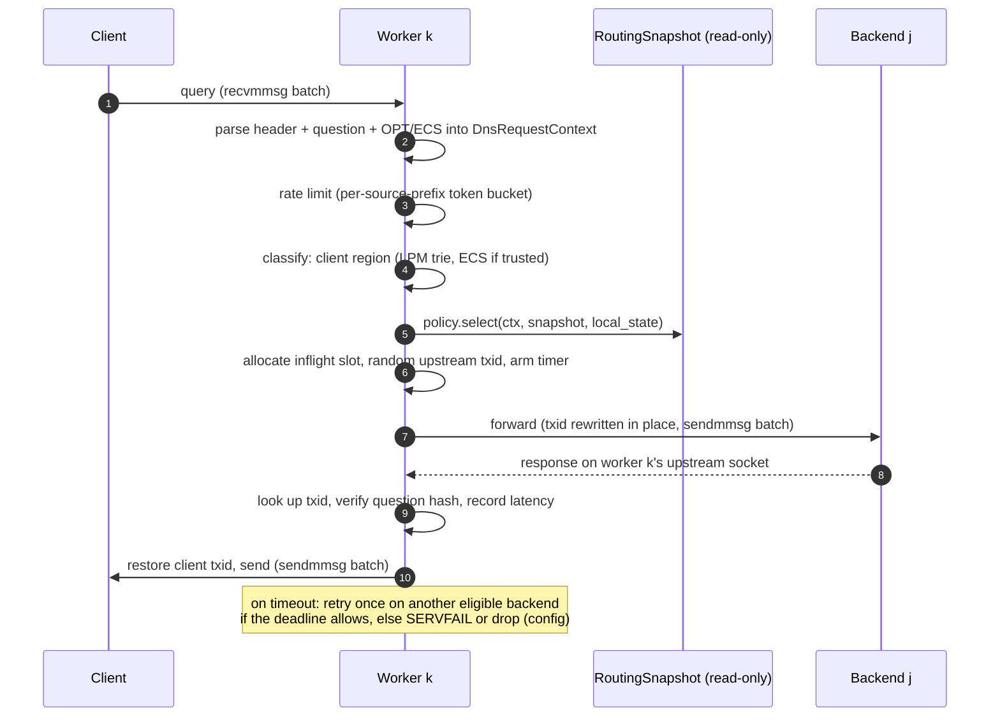
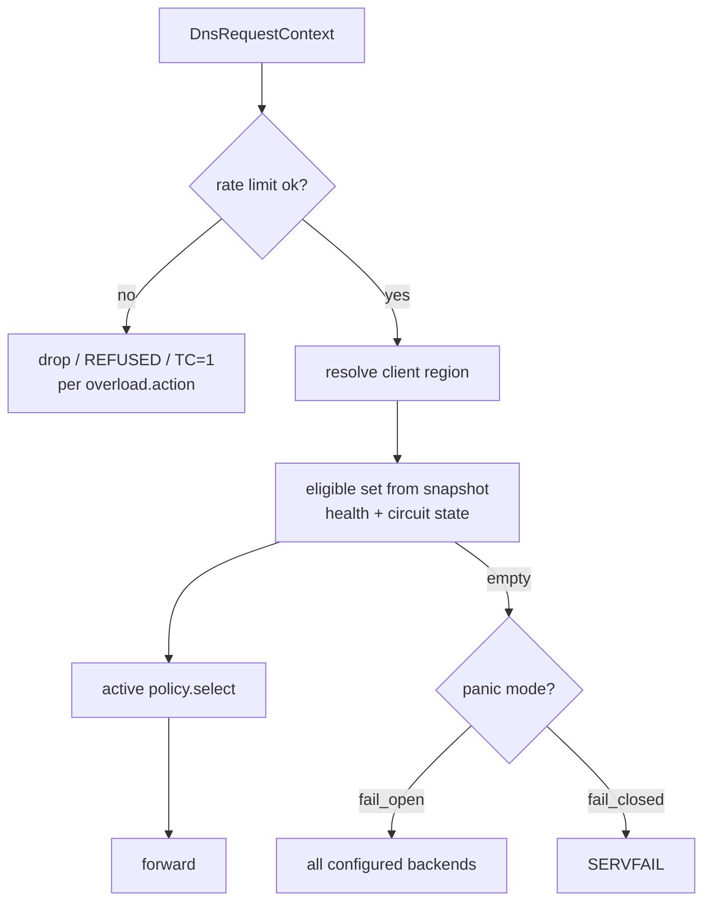
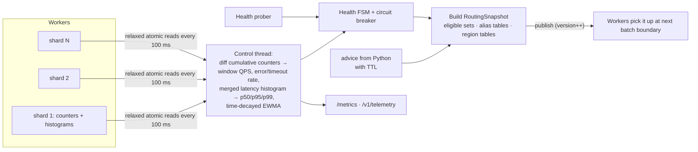
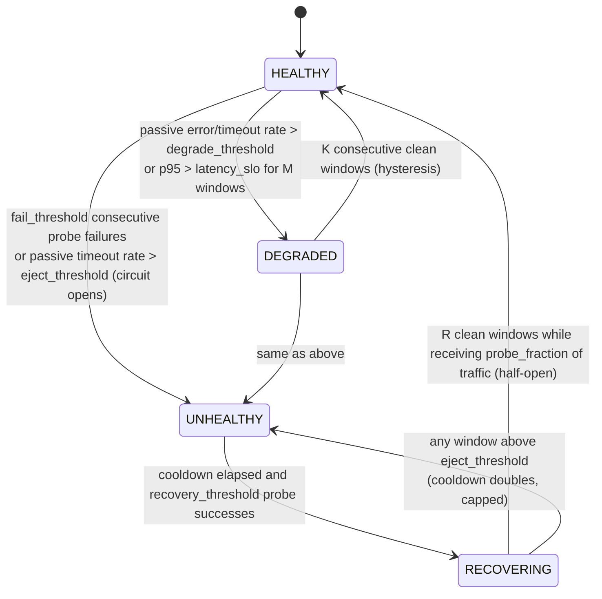

# Hyperfast DNS Load Balancer — Architecture

Status: **Milestone 0 design.** Nothing described here is implemented yet unless
marked otherwise. Performance figures are targets, not results: every result is
**NOT MEASURED** until a benchmark produces it.

---

## 1. What the system is (and is not)

The system is a **DNS-aware load balancer** that sits in front of a pool of
authoritative / edge DNS backends ("POPs"). For each query it decides which
backend answers it, forwards the query, and relays the response. It is
**not** a recursive resolver, and it does **not** answer from its own zone data.
Response caching is off by default and, if added, is benchmarked separately (§10).

It is split into four planes that share configuration types but not threads:

| Plane | Language | Runs where | Latency budget |
|---|---|---|---|
| **Fast data plane** | C++23 | `hfdns-lb` worker threads | per query: sub-microsecond decision, zero heap allocation in steady state |
| **Local control loop** | C++23 | `hfdns-lb` control thread (same process, off the packet path) | every 100 ms (configurable) |
| **Adaptive / ML control plane** | Python | `hfdns-control` process | every 500 ms (configurable); may be absent |
| **Management / observability** | Python API + TypeScript dashboard | `hfdns-control`, `frontend` | human time scale; may be absent |

**Invariant:** the data plane keeps forwarding queries correctly, and keeps
failing over, if the Python control plane, the dashboard, or Prometheus are all
stopped. Every external input to the data plane has a TTL. When the TTL expires,
the data plane falls back to its built-in behaviour.



---

## 2. Process and thread model

`hfdns-lb` is one process. It has no internal RPC between its parts.

| Thread | Count | Owns | Never does |
|---|---|---|---|
| **Worker** | N (config, default = physical cores − 1) | one `SO_REUSEPORT` UDP listen socket, one TCP listen socket, an epoll instance, its own upstream sockets to every backend, its own correlation table, timer wheel, rate-limiter shard, and telemetry shard | lock a mutex per packet, allocate on the heap in steady state, log per query at `info`, touch JSON |
| **Control** | 1 | telemetry aggregation, EWMA/percentiles, health state machine, circuit breaker, snapshot build and publish | block on network I/O |
| **Health prober** | 1 | active DNS probes to each backend | touch worker state |
| **Admin** | 1 | HTTP server on `127.0.0.1:8053` (cpp-httplib): `/healthz`, `/metrics`, `/v1/*`; JSON (de)serialization | run on a worker thread |
| **Encrypted listeners** | configurable (M15) | TLS/HTTP2/QUIC termination; each is an event loop with its own upstream sockets and correlation table, the same as a worker | block UDP workers with handshakes |

Why each worker owns its upstream sockets: a backend's response comes back on
the socket that sent the query, so it reaches the same worker that holds the
matching correlation entry. **Correlation state is never shared between
threads.** `SO_REUSEPORT` hashes the client 4-tuple, so the kernel spreads
client load across workers without a dispatcher thread.

---

## 3. Data flow: one UDP query



### 3.1 Internal request model

Every transport produces the same fixed-size structure (the routing code never
sees the transport):

```cpp
struct DnsRequestContext {           // lives in the worker's preallocated ring
    uint64_t    arrival_ns;          // CLOCK_MONOTONIC
    uint64_t    question_hash;       // hash(lowercased qname, qtype, qclass)
    ClientAddr  client;              // sockaddr_storage-compatible, inline
    uint16_t    client_txid;
    uint16_t    qtype, qclass;
    uint8_t     qname_wire[255];     // wire format, inline (no heap)
    uint8_t     qname_len;
    Transport   transport;           // UDP, TCP, DoT, DoH, DoQ
    RegionId    client_region;       // resolved once, before policy selection
    EdnsInfo    edns;                // present, udp_size, DO bit, ECS prefix (optional)
    uint32_t    listener_id;
};
```

### 3.2 Correlation table (per worker, per backend)

- The upstream transaction ID is **random for every query** (RFC 5452). Each
  upstream socket is connected and bound to a random ephemeral port, so an
  off-path attacker has to guess about 16 bits of txid plus the source port.
- The table is open-addressed and keyed by txid, sized to `2 × max_inflight`
  (config). The slot is 64 bytes, one cache line, and holds: client address,
  client txid, question hash, send timestamp, deadline, generation, and listener.
- A response is accepted only if the txid is present, the generation matches,
  **and** the question hash matches. Anything else is counted as
  `dns_upstream_mismatch_total` and dropped. This also protects against late
  responses after a slot has been reused.
- **Memory bound** (default `max_inflight = 4096` per worker per backend):
  8192 × 64 B = 512 KiB per worker per backend. That is 16 MiB for 8 workers ×
  4 backends. This matters on the 7.8 GiB development machine (§12).

### 3.3 Timeouts

Each worker has one hashed timer wheel (1 ms tick). Timers are cancelled lazily:
a response bumps the slot's generation, so an expiring timer that sees a
different generation is a no-op. On timeout the worker can retry once on the next
eligible backend if `retry.max_attempts > 1` and the remaining client budget
allows it. After that it answers SERVFAIL or drops, depending on
`on_upstream_timeout`.

### 3.4 Batching and buffers

- Workers read and write with `recvmmsg` / `sendmmsg`, batch size 32–64 (config).
- Packet buffers come from a per-worker preallocated pool sized for EDNS(0)
  (4096 B default; `edns.max_udp_payload` configurable). The query is forwarded
  **from the receive buffer itself**. The only change is the 2-byte txid rewrite.
- The DNS parser works inside a per-worker memory pool that is reset after each
  packet, so steady-state parsing does no `malloc`.

---

## 4. Routing: policy flow



### 4.1 Policy interface

```cpp
class Policy {
public:
    virtual ~Policy() = default;
    // Must be allocation-free and must not block. `local` holds exact,
    // worker-local signals (inflight, RR cursor, RNG); `snap` holds global
    // signals that are up to one control period old.
    virtual BackendId select(const DnsRequestContext& ctx,
                             const RoutingSnapshot& snap,
                             WorkerLocalState& local) = 0;
};
```

Policies are chosen by configuration, can be switched at runtime (a new snapshot
carries the new policy id), and each has its own
`dns_policy_decisions_total{policy,backend}` counter.

| Policy | Mechanism | Signals |
|---|---|---|
| `round_robin` | per-worker cursor over the eligible set | none |
| `weighted` | Vose alias table built by the control loop: O(1) sample with a per-worker xorshift RNG (seedable for deterministic tests) | static weights |
| `least_inflight` | power-of-two-choices (P2C) over worker-local inflight counts; full scan when the backend count ≤ 4 (config) | exact local inflight |
| `latency_based` | weights ∝ `1 / ewma_latency^k` turned into an alias table; P2C tie-break on local inflight to avoid herding on the single fastest backend | snapshot EWMA + local inflight |
| `geo_aware` | preference tiers from the region affinity matrix; within a tier, the lowest measured latency wins. `geo.mode = geo_first` or `latency_first` | region matrix, snapshot EWMA |
| `health_aware` | weighted, with each backend's weight multiplied by a health factor (HEALTHY 1.0, DEGRADED configurable e.g. 0.25, RECOVERING = probe fraction, UNHEALTHY 0) | health FSM |
| `adaptive` | per-region alias table from control-plane **advice** (heuristic or ML scores → weights), then P2C on local inflight between two weighted samples. If the advice TTL has expired, it degrades to the built-in `latency_based` + `health_aware` | advice + snapshot + local |

**Health filtering** is a separate stage before every policy, not a feature of
one policy. For experiment Q2 it can be switched off (`health.enforce: false`),
which gives a "health-blind" variant of any policy.

### 4.2 Adaptive score (control plane)

For backend *b* and client region *r*, over the latest window:

```
score(b, r) = w_latency · norm(latency_estimate(b, r))
            + w_load    · norm(qps(b) / capacity(b))
            + w_error   · norm(error_rate(b) + timeout_rate(b))
            + w_geo     · norm(geo_distance(r, region(b)))
            + w_queue   · norm(inflight(b))
            + w_risk    · failure_risk(b)
weight(b, r) = softmax(−score(b, r) / temperature) over eligible b
```

- `latency_estimate` is the time-decayed EWMA in heuristic mode and the model
  prediction in ML mode. **That is the only difference between the two modes**,
  so the Q4 ablation isolates the predictor.
- `norm` is min-max over the eligible set, clamped to [0, 1].
- Weights are smoothed across updates (`weight_t = β·new + (1−β)·weight_{t−1}`)
  and capped per step to prevent oscillation. Stale-information herding is a
  known failure mode of load balancers (Dahlin, see RESEARCH_NOTES.md).
- The data plane also runs a C++ implementation of the heuristic score. It is
  used as the fallback when advice expires and as the in-process "adaptive
  heuristic" for measuring the overhead of the external control layer (Q8).

---

## 5. Control flow and telemetry flow



**Telemetry shards.** Each worker has a cache-line-aligned shard per backend:
monotonic counters (queries, responses by rcode class, timeouts, mismatches,
rate-limited, retries) and a log-linear latency histogram with about 1–2%
relative error over the range 1 µs – 10 s. The owning worker writes with
`memory_order_relaxed` and the control thread reads. There are no locks. The
histograms are mergeable, so global percentiles are exact up to bucket
resolution. They are not averages of per-worker percentiles.

**Snapshot publication (RCU style).** The control thread builds an immutable
`RoutingSnapshot`, stores it in a `shared_ptr`, and increments an atomic
`version`. At every batch boundary (not per packet) a worker compares its cached
version and, only if it changed, takes the new pointer. The old snapshot is freed
when the last worker drops its reference. Each worker pays one relaxed atomic load
per batch.

**Staleness contract.** Worker-local signals (inflight, round-robin cursor) are
exact. Snapshot signals are at most one control period old (100 ms default).
Advice is at most one Python period plus its TTL old. Every snapshot records its
age, which is exported as `dns_routing_snapshot_age_seconds`.

**Metrics** (Prometheus text, served by the admin thread): `dns_queries_total`,
`dns_responses_total{rcode}`, `dns_errors_total{kind}`,
`dns_query_latency_seconds` (histogram), `dns_backend_requests_total{backend}`,
`dns_backend_latency_seconds{backend}`, `dns_backend_inflight{backend}`,
`dns_backend_health{backend,state}`, `dns_backend_failures_total{backend,kind}`,
`dns_policy_decisions_total{policy,backend}`, `dns_rate_limited_total{action}`,
`dns_failover_total{from,to}`. Labels are limited to backend, region, policy,
rcode class, transport, and state. Raw qnames and client IPs are never labels.

**Logs.** Structured JSON (spdlog, asynchronous sink), with the level set by
`LOG_LEVEL`. Per-query logs exist only at `trace`, and trace output is sampled.

---

## 6. Failure flow: health state machine



- **Active signals:** DNS probe queries (configured qname/qtype, expected rcode)
  every `health.interval`, each with its own timeout.
- **Passive signals:** per-window timeout rate, SERVFAIL rate, and p95 against
  the SLO. These come from the telemetry of real traffic, so failures are seen
  between probes.
- **Ejection guard:** at most `max_ejection_percent` of backends can be ejected
  by passive signals alone (the Envoy outlier-detection idea). If every backend
  is ineligible, `panic_mode` chooses fail-open (use all) or fail-closed
  (SERVFAIL).
- Each transition emits a structured event
  `{"event":"health_transition","backend":..,"from":..,"to":..,"reason":..}` and
  increments `dns_backend_health` / `dns_failover_total`.
- **Failover recovery time** is measured by the load generator, not by the load
  balancer's own view. It is the time from the fault-injection timestamp
  (recorded by the backend simulator) to the first 100 ms bin after which the
  client success rate stays ≥ 99% for 1 s. The exact definition goes in
  BENCHMARKING.md (M11).

---

## 7. Resilience: overload, rate limiting, flash crowds (M12)

| Mechanism | Where | Design |
|---|---|---|
| Per-source-prefix rate limit | worker | Token bucket keyed by /24 (IPv4) or /56 (IPv6) in a fixed-size table with clock-hand eviction. A limit is applied per worker, so the effective global limit is approximately `limit × workers_seen_by_prefix`. This is documented rather than hidden. |
| Global overload shedding | worker | If worker inflight or queue depth exceeds the threshold, the configured action is taken: `drop`, `refused`, or `truncate` (TC=1 pushes legitimate clients to TCP, like the "slip" in DNS RRL). |
| Circuit breaker | control thread | Passive ejection in the health FSM (§6). |
| Cooldown / backoff | control thread | The ejection cooldown doubles on each repeated failure, up to a cap. |

The load generator refuses any target outside loopback or RFC 1918 / Docker
bridge ranges. There is no override flag.

---

## 8. Transports

| Order | Transport | Milestone | Termination | Upstream |
|---|---|---|---|---|
| 1 | UDP | M2–M3 | worker | UDP |
| 2 | TCP (RFC 7766 / 9210) | M14 | worker (non-blocking, pipelined, length-prefixed, idle timeout) | UDP, falling back to TCP on TC=1 |
| 3 | DoT (RFC 7858) | M15 | encrypted-listener loop (OpenSSL) | UDP/TCP |
| 4 | DoH (RFC 8484) | M15 | encrypted-listener loop (nghttp2 + OpenSSL) | UDP/TCP |
| 5 | DoQ (RFC 9250) | M15 | encrypted-listener loop (ngtcp2) | UDP/TCP |

Every transport produces a `DnsRequestContext`, so policies and telemetry don't
depend on the transport. UDP responses with TC=1 are passed to the client
unchanged, and the client retries over TCP.

---

## 9. Packet I/O abstraction (fast path, M16)

```cpp
class PacketIO {                         // client-facing side only
public:
    virtual size_t rx_batch(std::span<PacketBuf> out) = 0;
    virtual size_t tx_batch(std::span<const PacketBuf> in) = 0;
};
// LinuxSocketIO : recvmmsg/sendmmsg on SO_REUSEPORT sockets   (default, always available)
// AfXdpIO       : AF_XDP socket + libxdp's bundled redirect program (optional, Linux only)
```

- The upstream side always uses kernel sockets.
- The project may not contain hand-written BPF programs, because BPF programs
  are written in restricted C and the language policy forbids it. The AF_XDP
  path therefore uses the redirect program that ships with libxdp, and
  **XDP-level DDoS filtering is not implemented** (see RESEARCH_NOTES.md).
- Under WSL2 / Docker Desktop, only generic-mode (SKB) XDP on veth is realistic,
  so an AF_XDP gain may not show up there. That outcome would be reported, not
  hidden.

---

## 10. Caching policy

Caching is off by default. If a TTL-aware packet cache is ever added, it will be
opt-in per zone, will respect RFC 2308 negative-caching TTLs, and will be
benchmarked with caching OFF and ON as separate results. It is not on the
milestone path, because the load balancer fronts authoritative backends whose
consistency assumptions it cannot see.

---

## 11. Region model and geo-awareness

- Client region is found by longest-prefix match on a configured CIDR → region
  table, a static poptrie-style lookup built at config load. In the emulation,
  the load generator sends from distinct loopback source addresses such as
  `127.1.x.y` for india and `127.2.x.y` for europe, so region inference is
  exercised through real packets.
- **ECS (RFC 7871)** is optional. If `geo.trust_ecs: true`, an ECS option in the
  query can override the source-address region. ECS is a hint, not proof, and it
  exposes client subnet data upstream, so it defaults to off (see SECURITY.md,
  M20).
- The load balancer keeps two separate matrices: **geographic affinity** (static
  config) and **measured latency** (EWMA per backend, and per client region where
  the emulation provides per-region RTT). `geo.mode` chooses which one leads.
  The design never assumes that geographic distance equals network latency.

---

## 12. Deployment and environment

- **Target runtime: Linux** (epoll, `SO_REUSEPORT`, `recvmmsg`, AF_XDP). The data
  plane is not built for native Windows.
- **Development host** (measured at M0): Intel i5-10300H, 4 cores / 8 threads,
  7.8 GiB RAM, Windows 11 build 26200. C++ builds and benchmarks run inside WSL2
  Ubuntu 24.04.5 (kernel 6.6, 8 vCPUs, 3.7 GiB RAM), and the full demo inside
  Docker Compose. All numbers from this host are labelled as virtualized (WSL2)
  loopback measurements.
- Benchmark runs start only the load balancer, backends, and load generator,
  pinned to disjoint CPU sets where possible. The dashboard and Prometheus stay
  off during measurement, because with 7.8 GiB RAM and 8 logical CPUs they would
  distort the results.

---

## 13. Repository layout

```
/
├── README.md  PROJECT_PLAN.md  ARCHITECTURE.md  RESEARCH_NOTES.md
├── BENCHMARKING.md  EXPERIMENTS.md  SECURITY.md          (M11 / M12 / M20)
├── CMakeLists.txt                  C++ superbuild: core, backend-simulator, load-generator
├── Makefile                        thin entry points that call CMake / Python (M1)
├── docker-compose.yml              full demo (M19)
├── core/                           C++: libhfdns (DNS model, policies, telemetry, health) + hfdns-lb
│   ├── include/hfdns/  src/  tests/  bench/
├── backend-simulator/              C++: hfdns-backend (latency/jitter/loss/errors/outages, admin API)
│   ├── src/  configs/
├── load-generator/                 C++: hfdns-bench (open-loop, Poisson/ramp/burst, per-region sources)
│   ├── src/  scenarios/
├── control-plane/                  Python: FastAPI management API + adaptive scorer
├── ml/                             Python: telemetry dataset generation, training, model artifacts
│   ├── training/  inference/  datasets/  models/
├── benchmarks/                     Python: scenario runner and analysis; scenario YAML; results
│   ├── scenarios/  results/
├── frontend/                       TypeScript: Next.js dashboard
├── config/                         dev.yaml  benchmark.yaml  stress.yaml  encrypted.yaml
├── scripts/                        Python automation (run_dev.py, run_benchmark.py, ...)
├── deploy/docker/                  Dockerfiles
└── docs/  diagrams/  experiments/
```

Changes from the suggested layout:
- `control-plane/` is Python, not a Rust crate (language policy).
- `scripts/*.sh` are Python (`scripts/*.py`), because automation is Python-only
  by policy.
- A single top-level CMake project builds the three C++ components against one
  shared library (`libhfdns`), so the backend simulator and load generator use
  the same DNS code and histograms as the load balancer.
