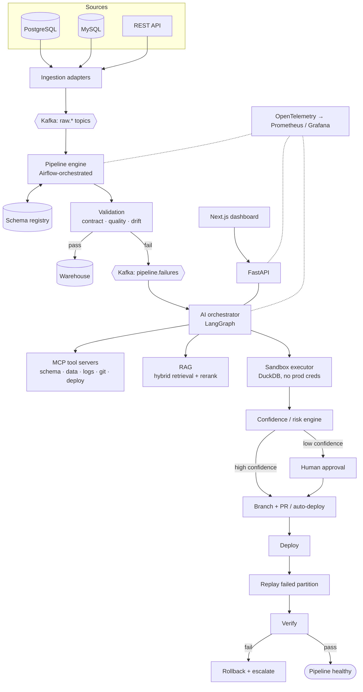
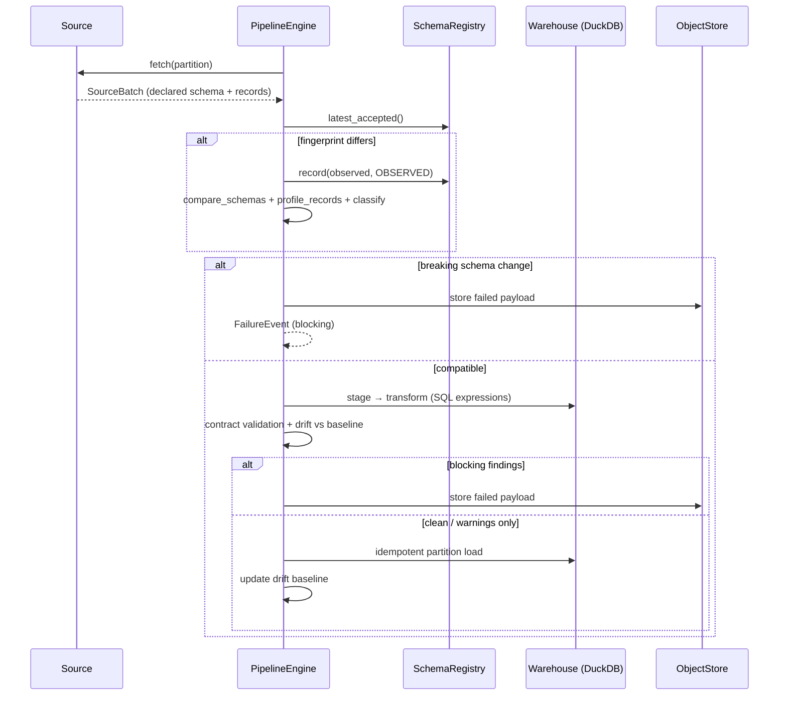

# Architecture

Adaptive Self-Healing Data Pipeline is an autonomous data-reliability platform. It
detects schema and data-quality failures, investigates them with an agent that
uses narrow tools and historical knowledge, proves a repair in a sandbox, and
restores the pipeline. Ambiguous incidents go to a human.

The central loop is:

```
DETECT → DIAGNOSE → PLAN → SANDBOX → TEST → SCORE → APPROVE → REPAIR → REPLAY → VERIFY
```

## Design principles

1. **Detection is deterministic.** No LLM decides whether a run failed. Diffs,
   profiles, contract checks, and drift statistics are reproducible facts. The
   agent reasons over those facts.
2. **Evidence before action.** Every failure event carries the schema diff,
   column profiles, violations, drift statistics, and sample records. Diagnosis
   starts from data, not guesses.
3. **Nothing AI-generated touches production directly.** Repairs are edits to a
   declarative pipeline definition. They run in a sandbox first and are gated by
   a measured confidence/risk score.
4. **Fail safe.** When the system is uncertain, it does not act. If the sandbox
   fails, nothing is deployed. If post-deploy verification fails, the change is
   rolled back.
5. **Tenant isolation everywhere.** Every store is keyed by `tenant_id`, down to
   the tenant's own DuckDB schema in the warehouse.

## Target architecture



## Pipeline run (implemented in Milestone 1)



### Key concepts

| Concept | Where | Notes |
|---|---|---|
| **Pipeline definition** | `config/tenants/<tenant>/pipelines/*.yaml` | Declarative. `transformations` maps each output column to a SQL expression over the staged source row. **A repair is an edit to this mapping.** |
| **Data contract** | `config/tenants/<tenant>/contracts/*.yaml` | Output guarantee: types, nullability, keys, quality rules, drift policy. |
| **Schema registry** | `app/registry` | Versioned *source* schemas. `ACCEPTED` is what transformations are written against. New shapes are recorded as `OBSERVED` until a repair accepts them. Fingerprints make recording idempotent. |
| **Source batch** | `app/pipeline/sources.py` | One partition plus its *declared* schema (a Kafka Connect style envelope). Schemaless sources get an inferred schema. |
| **Failure event** | `app/detection/events.py` | Self-contained incident seed: findings, diff, profiles, violations, drift reports, samples, and a fingerprint for de-duplication. |

### Separating input schema from output contract

The registry tracks what upstream *sends*. The contract defines what the warehouse
*guarantees*. The two evolve independently, and the transformations bridge them.
When upstream changes `customer_id` from INTEGER to STRING, the contract stays the
same. The repair accepts the new source schema version and changes the
transformation to `CAST(customer_id AS BIGINT)`. This is the loop the agent
automates.

## Detection coverage

| Category | Failure types | Mechanism |
|---|---|---|
| Schema drift | type change, column added / removed / renamed, nullability change, constraint change | `compare_schemas`: structured diff. Renames are inferred from name similarity or value overlap with warehouse history, never assumed. |
| Data quality | type mismatch, missing column, unexpected nulls, duplicates, invalid format, out of range, outliers (IQR), invalid enum, referential integrity | `validate_contract` over transformed output |
| Pipeline failure | transformation exception, SQL failure, API schema failure, missing partition, malformed JSON | exceptions typed at the source-adapter and warehouse boundaries |
| Semantic drift | distribution drift | PSI, two-sample KS, and mean shift against a reservoir-sampled baseline. **Two of three** signals must fire. Drifted batches never update the baseline. |

Value profiles add evidence to type changes. For example: "100% of values are
integer-like" or "format `%d/%m/%Y %H:%M:%S` parses 100% of values". The detected
`strptime` pattern works unchanged in both Python and DuckDB, so a repair can use
it directly.

## Repository layout

```
backend/
  app/
    core/        types, config, structured logging
    registry/    schema versions + stores
    contracts/   data-contract model
    detection/   profiling, schema diff, quality, distribution drift, classifier, events
    pipeline/    definitions, sources, simulator, warehouse, engine
  tests/         unit/ and integration/
config/tenants/  per-tenant pipeline definitions and contracts
scripts/         run_demo.py
docs/
```

## Milestones

| # | Milestone | Status |
|---|---|---|
| 1 | ETL + schema registry + failure detection | ✅ |
| 2 | Kafka + event-driven architecture | |
| 3 | FastAPI + database + incident management | |
| 4 | LangGraph agent | |
| 5 | MCP tools | |
| 6 | RAG + repair memory | |
| 7 | Sandbox + test generation | |
| 8 | Confidence / risk engine | |
| 9 | Git integration + PR workflow | |
| 10 | Deployment + rollback + replay | |
| 11 | Observability dashboard | |
| 12 | Evaluation + benchmark | |
| 13 | Security + multi-tenancy | |
| 14 | Final polish + documentation + demo | |
